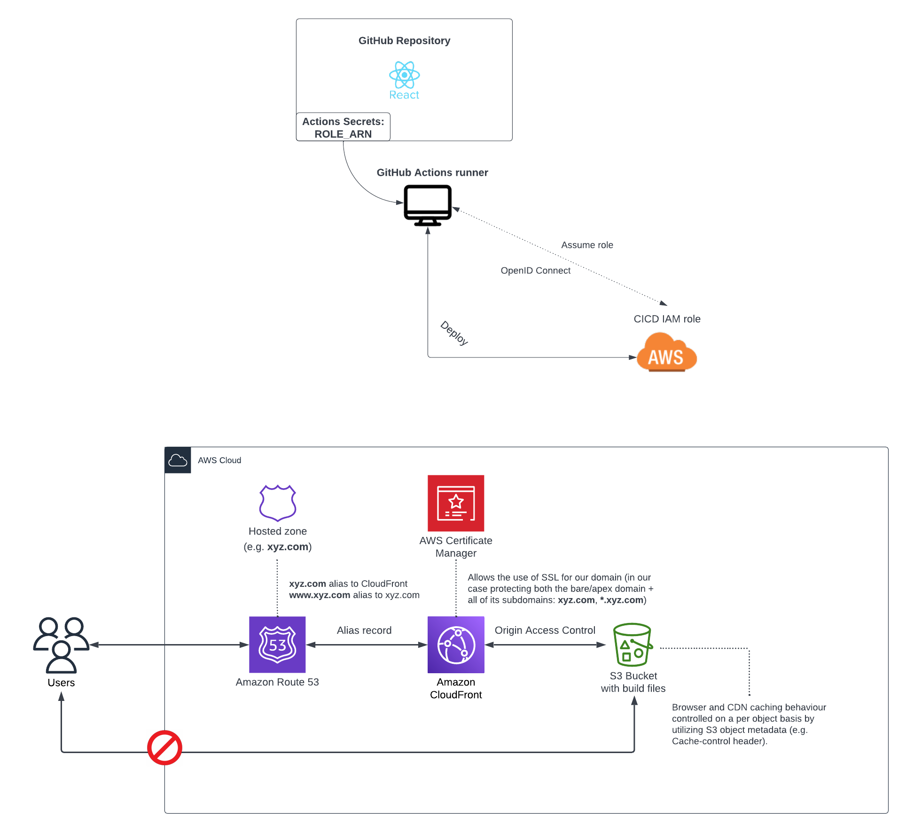

# React App

This project includes a sample best practice React app with the following:

- deployed on AWS (with infrastructure provisioned through Terraform)
- full CI/CD pipeline using GithubActions
- pre-commit and pre-push hooks
- automatic release (using the [conventional commits](https://www.conventionalcommits.org/en/v1.0.0/) specification and [semantic versioning](https://semver.org/))

### Architecture:

Caching strategy ([see here](https://create-react-app.dev/docs/production-build/#static-file-caching)):

- cache all assets inside of the `build/static` folder for a year (`Cache-Control: max-age=31536000`) - this is possible thanks to the fact that each time the contents of a file changes the filename hash will be different
- explicitly disable caching on everything else (`Cache-Control: no-cache`) - this way we ensure that the user's browser will always check for an updated `index.html`.

### How to deploy?

#### Prerequisites

- an AWS account
- programmatic access to AWS (aws cli)
- your own domain (purchased from AWS Route53)

#### Steps:

1.  Clone the repository
2.  `npm install`
3.  Update all `# TODO:` placeholders with the appropriate values for you ([screenshot](screenshots/update-todos-placeholders.png))
4.  Bootstrap Terraform - this will provision the infrastructure required to store your terraform state remotely and also the IAM role assumed by the Github Actions CICD worker through OIDC ([see here](infrastructure/bootstrap/README.md))
5.  Create a new branch, switch to it, commit and push your changes, create a pull request and merge it (e.g. `chore: provision initial infrastructure`) - with the updated values for the placeholders and the infrastructure for the remote Terraform backend provisioned, you can now proceed with creating your first pull request, which will provision all of the infrastructure required for the React application (Route53 records, ACM certificates, CloudFront distribution, S3 bucket, etc.). It is a good idea to keep an eye on the deployment pipeline as the creation of the CloudFront distribution can sometimes take up to 15min.
6.  At this point you should now be able to access your website on the domain that you have specified earlier or by prepending it with `www.`

### Cleanup

- navigate to the `infrastructure/terraform/` folder
- `terraform init`
- `terraform destroy`
- navigate to the `infrastructure/bootstrap/` folder
- `terraform init -migrate-state`
  - you will be prompted whether you want to copy the existing state to the new backend, enter `yes`
- `terraform destroy`
